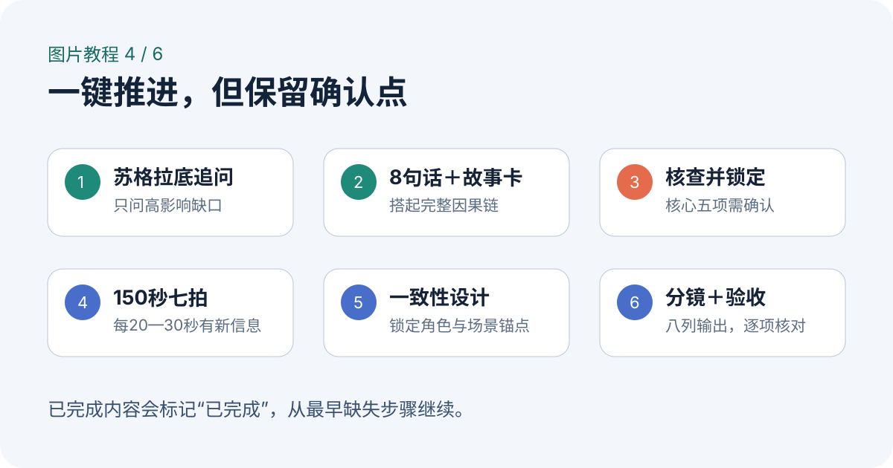
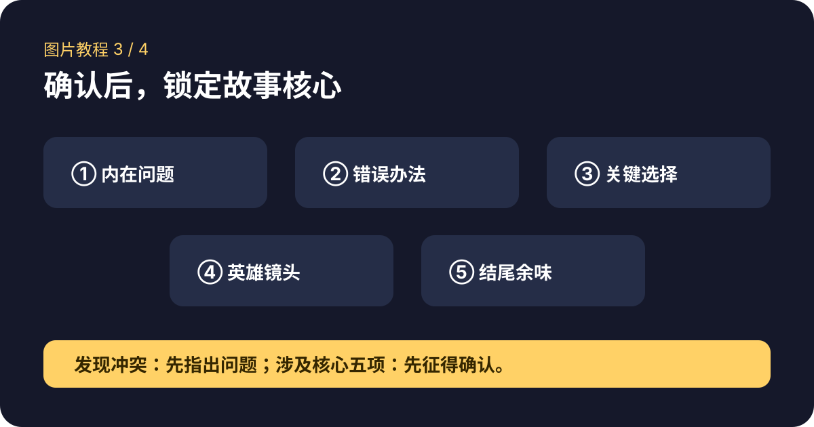
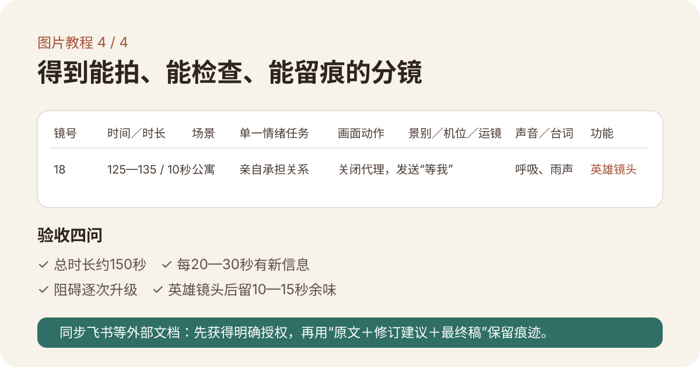

# idea-to-storyboard｜一键式短片分镜

把一句短片想法，经苏格拉底追问、8句话故事、故事设计卡、逻辑核查、150秒七拍和一致性设计，整理成可执行的AI分镜表。

> 核心观念：短片不是压缩长片，而是放大一次选择。


## 一句话使用

在支持 Skills 的 Codex 中安装本仓库后输入：

```text
$idea-to-storyboard 把这个想法做成150秒短片分镜：20年后，人类把情感关系交给AI代理。
```

也可以直接说“帮我把这个想法做成短片分镜”“用8句话故事法完善这个故事”或“一键从想法到分镜”。



## 它会先锁定什么

继续拆分镜头前，Skill 会明确锁定五项内容：主角的内在问题、错误办法、关键选择、英雄镜头和结尾余味。未经确认，不擅自改变。



## 最终得到什么

- 核心表达与苏格拉底追问结论
- 8句话故事与故事设计卡
- 逻辑核查和不可改动核心
- 150秒七拍结构
- 角色与场景一致性卡
- 10秒英雄镜头
- 150秒八列分镜表
- 信息密度、阻碍升级、时长与一致性验收



完整案例见 [《那只歪船》](examples/the-crooked-boat.md)。该案例由本人的飞书文档导出并整理为 Markdown。

## 仓库结构

```text
idea-to-storyboard/
├── SKILL.md
├── agents/openai.yaml
├── references/
├── docs/images/
├── examples/the-crooked-boat.md
├── SECURITY.md
└── dist/idea-to-storyboard.skill
```

## 安装与启用

1. 克隆或下载本仓库。
2. 将仓库目录作为 Skill 添加到支持 Skills 的工具；也可使用 Releases 中的 `idea-to-storyboard.skill`。
3. 在对话中输入 `$idea-to-storyboard`，随后粘贴一句想法、故事卡、剧本或已有分镜。

本仓库只提供创作方法与模板。写入飞书等外部系统时，必须先获得用户明确授权。

## 致谢

感谢 **抖音AI夜校**、**WaytoAGI**、**周鹏@鲤鱼与鱼ai** 对 AI 创作学习与方法分享的启发。

