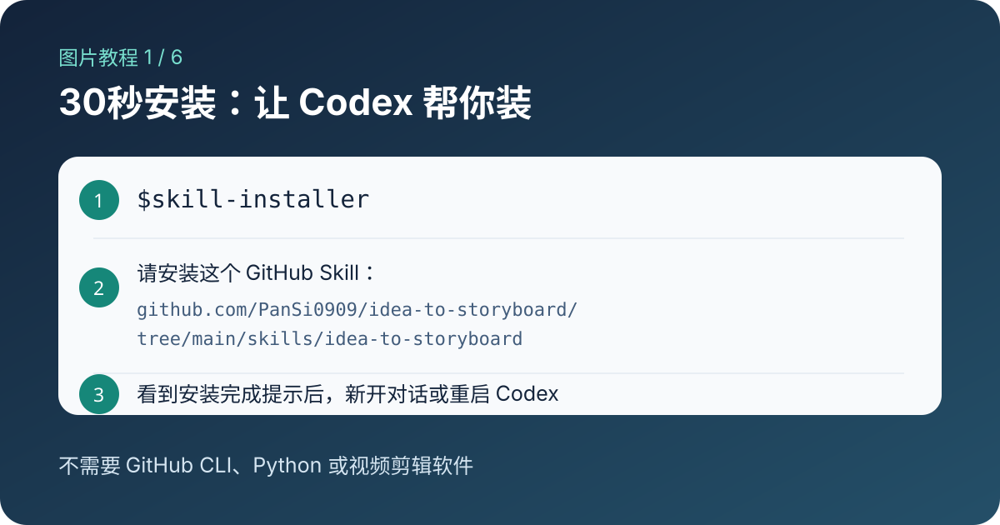
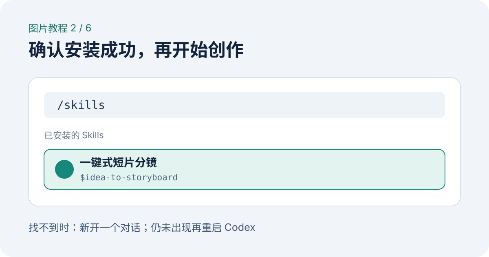

# 一键式短片分镜：小白使用指南

这份指南假设你没有写过剧本，也不知道什么是“七拍”“反向选择”或“英雄镜头”。你只需要准备一句故事想法。

## 一、先安装

在 Codex 中输入 `$skill-installer`，然后发送：

```text
请安装这个 GitHub Skill：
https://github.com/PanSi0909/idea-to-storyboard/tree/main/skills/idea-to-storyboard
```

看到安装完成提示后，新开一个对话。若 Skill 没有出现，重启 Codex。



用 `/skills` 或输入 `$`，确认列表中有 `idea-to-storyboard`。



## 二、第一次只写一句话

复制下面这句，把冒号后面的内容换成你的想法：

```text
$idea-to-storyboard 把这个想法做成150秒短片分镜：一个习惯让AI替自己说话的人，必须亲自完成一次告别。
```

不知道角色姓名、结局或拍摄方法都没关系。

## 三、回答关键问题

如果信息不足，Skill 通常会问1—3个问题，例如：

1. 主角今天必须完成什么？
2. 如果失败，他会立刻失去什么？
3. 最后他愿意做出什么与旧习惯相反的行动？

可以用很短的句子回答，不需要写成文学语言：

```text
1. 今晚八点前去见一个多年未见的朋友。
2. 会错过朋友离开城市前最后一次见面。
3. 不再让AI替自己回复，亲自去见面。
```

## 四、确认故事核心

Skill 会整理故事设计卡，并特别列出五项核心：

- 内在问题
- 错误办法
- 关键选择
- 英雄镜头
- 结尾余味

检查这些内容是否仍然是你的故事。如果不对，直接指出哪一项需要调整；确认后再继续拆分镜头。

## 五、理解最终分镜

分镜表每一行代表一个镜头，固定包含：

| 字段 | 小白理解 |
|-|-|
| 镜号 | 镜头顺序 |
| 时间／时长 | 这个镜头从第几秒开始、持续多久 |
| 场景 | 故事发生在哪里 |
| 单一情绪任务 | 观众在这一镜需要读懂什么变化 |
| 画面动作 | 演员或物体具体做什么 |
| 景别／机位／运镜 | 摄像机离人物多远、放在哪里、怎样移动 |
| 声音／台词 | 环境声、提示音、对白或静默 |
| 功能标记 | 这一镜属于钩子、升级、选择还是结尾 |

不需要自己计算时长。Skill 会检查总时长、信息密度、阻碍升级和角色场景一致性。

## 六、看完整案例

原创示例案例 [《那只歪船》](../examples/the-crooked-boat.md) 展示了从核心表达到21个镜头的完整结果。第一次阅读时建议依次看：

1. 核心表达：故事到底放大哪一次选择。
2. 8句话故事：因果链是否完整。
3. 不可改动的核心锁定：什么不能被AI擅自重写。
4. 150秒分镜表：抽象情绪怎样变成动作和镜头。

## 七、你可以从任何阶段开始

- 只有一句想法：从苏格拉底追问开始。
- 已有8句话或故事卡：直接核查逻辑。
- 已有完整剧本：提取核心并整理150秒节奏。
- 已有分镜：只检查时长、情绪任务、升级和一致性。
- 已有文档：先读取；只有明确授权且环境支持时才写回。

## 八、记住两个边界

1. Skill 生成故事设计和文字分镜，不直接生成最终视频。
2. Skill 不应擅自改变你的内在问题、错误办法、关键选择、英雄镜头和结尾余味。
